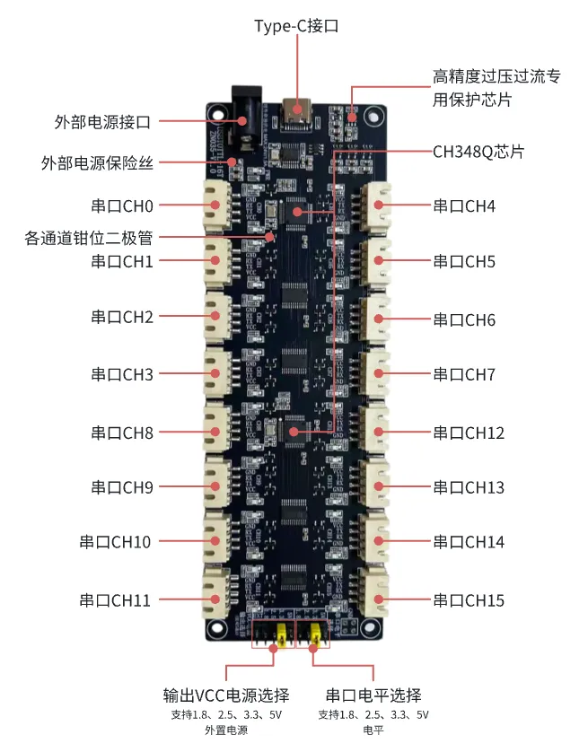
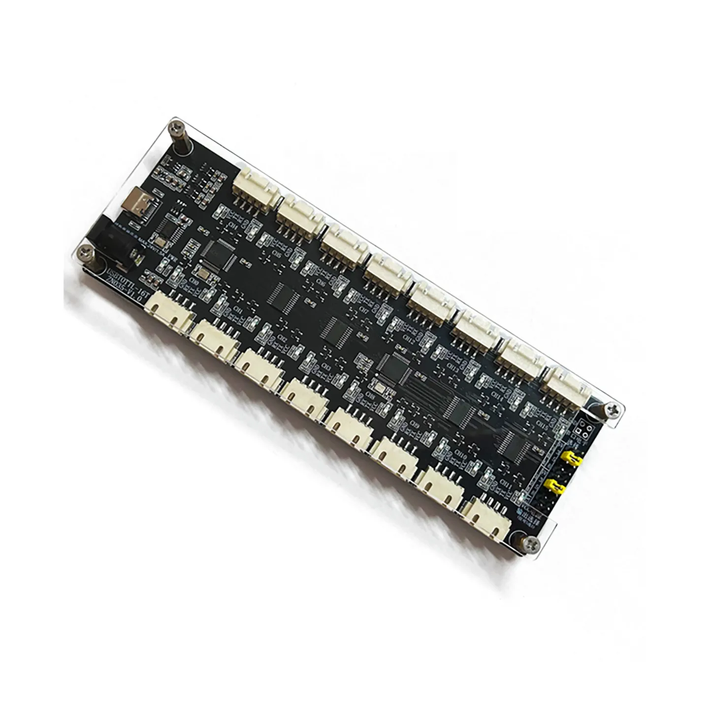
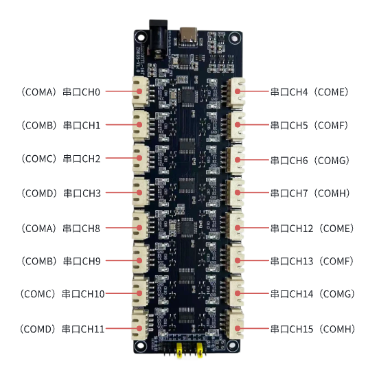
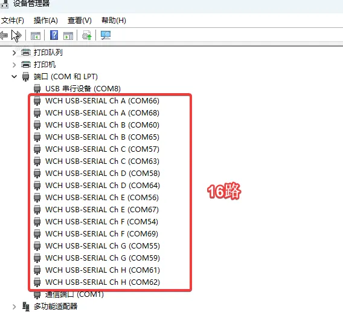
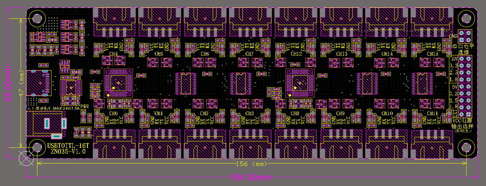

# MD0835-16路双电平串口模块

MD0835为一款16路USB转TTL工具板，通过Type-C口与电脑端进行连接，可接入外置电源，灵活配置5档输出电压，通过跳线帽可切换四种电平。默认配亚克力盖，对外接口为XH2.54-4P端子。

# 端口映射

电脑上的端口号A-H对应串口模块上的Ch0-Ch7，Ch8-Ch15

例如，以下COM66和COM68，均是ChA，此时需要连接测试，具体判断COM66是CH0还是CH8：

# 驱动程序(Windows&Linux)

[驱动下载](https://2h.hk/upload/CH348Q%E9%A9%B1%E5%8A%A8.zip)

# 使用教程

TTL电平选择：用跳线帽上下短接相应的电平，必须四选一

VCC电源输出选择：用跳线帽上下短接相应的VCC电源，五选一，选择EXT即输出接入的电平

# 定位孔距离

定位孔规格：M3

# **Q&A**

Q：USB插入电脑后，window电脑无法正常识别

A：请检查是否安装USB驱动程序，可以在PC端的设备管理器中查看，正常情况如下

Q：每个通道VCC电源带载情况如何？

A：每一路通信，包括VCC、GND、TX、RX，其中电源可以对外输出电压，其输出电流带载能力如下：

1. 使用板载LDO电源输出（1.8、2.5、3.3V、5V），16路总和带载能力为0.5A。
2. 使用外置的电源输出（EXT），外置电源规格为：电压最大24V，电流最大1.5A。16路总和带载能力为外置电源的能力，但是不建议超过24V、1.5A，板载自恢复保险丝（24V、1.5A）。